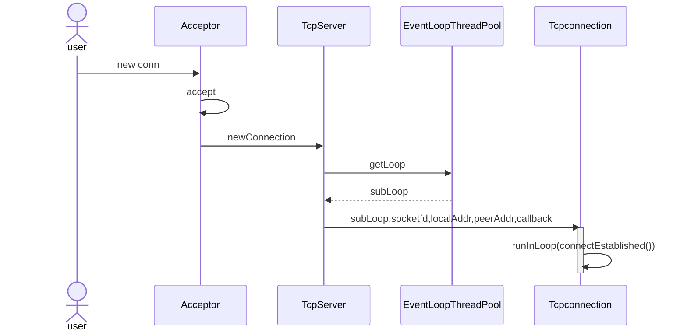

# TinyMuduo
muduo是陈硕开发的c++网络库。
* 使用**Reactor**模式实现。
* 通过**事件驱动**和**函数回调**的方法支持业务的实现。
* 框架基于**one loop per thread + thread pool**的形式。
本人基于c11重构了muduo库中的重要组件，旨在学习其中良好的设计思想。
## 框架

## 使用方法
* 编程实例见example
* sudo bash ./autobuild.sh

## 基础类

* **InetAddress**
  * 封装socket地址类型
* **Channel** 
  * 在io多路复用中，一个线程监视多个文件句柄。一旦其中某个句柄就绪，就能够通知对应的应用线程进行相应的读写操作。channel就是对其中文件句柄(文件描述符)的封装。
  * Channel将文件描述符及该描述符对应的回调函数绑定在一起，方便调用。
  * tie_: weak_ptr<void>: 用来跨线程判断该channel是否存在
* **Poller**
  * 抽象了负责监听事件描述符以及返回发生的事件描述符的模块(epoll/poll)。
  * 重构只支持epoll。
* **EPollPoller**
  * 继承自Pollor抽象层，使用epoll实现多路监听复用。
* **Socket**
  * 对sockfd相关方法的封装，bind、accept、listen、shutdown四件套。
* **Buffer**
  * Buffer类封装了用户缓冲区，以及向其中读写数据等方法。

设计方法：
1. 初始化状态。CheapPrepend记录整块数据的长度。
2. 一段时间后，向buffer中写入数据。数据分区为read(可读)，write(可写)。其中，readIdx标志可读区域起始位置，writeIdx标志可写区域起始位置。
3. 从可读区域中读取一部分数据后，会有部分buffer区域空闲。
4. 继续向数据区写入数据，可读区域变大，但是超出了buffer的大小。但是算上空白区域，buffer还可以容纳整个数据。
5. 整体数据向前调整。
6. 继续写入数据，但是这次算上空白区域也无法满足数据要求，则扩容。
* **Acceptor**
  * Acceptor只作用于baseLoop
  * 其封装了socketfd与channel，用来监听新用户的连接以及执行相应的回调。
  * 当有新连接来时，会执行channel里绑定的handleread
    (handleread中其实绑定了TcpSever的newConnection
    TcpSever会挑选一个subLoop去处理该回调).
* **EventLoop**
  * EventLoop中封装了poller与channel，他不停调用poller中的poll方法来获取实际发生的事件(activeChannel)，然后调用activeChannel中保管的不同类型事件处理函数来处理实际发生的事件。
## one loop per thread + thread pool
* one loop per thread是指每一个eventLoop都会绑定一个线程
* Eventloop
  * __thread修饰的全局变量在每个线程里面都独有一份，借助该变量判断当前线程里面有没有eventLoop对象。
```c++
__thread EventLoop *t_loopInThisThread = nullptr;
EventLoop::EventLoop()
{
    if (t_loopInThisThread)
    {
        LOG_FATAL("Another EventLoop %p exists in this thread %d \n", t_loopInThisThread, threadId_);
    } else {
        t_loopInThisThread = this;
    }
}
```
* EventLoopThread
  * 创建线程时，在栈上创建一个loop对象，与thread一一对应。
```c++
EventLoop* EventLoopThread::startLoop()
{
    thread_.start(); // 启动EventLoopThread::threadFunc()函数
    EventLoop *loop = nullptr;
    {
        std::unique_lock<std::mutex> lock(mutex_); 
        while (loop_ == nullptr)
        {
            cond_.wait(lock); // 等待期间释放锁(创建好了loop对象)
        }
        loop = loop_;
    }
    return loop;
}
// 独立新线程运行
void EventLoopThread::threadFunc()
{
    EventLoop loop; //one loop per thread，单独创建一个eventLoop和线程一一对应
    {
        std::unique_lock<std::mutex> lock(mutex_);
        loop_ = &loop; // 成员变量
        cond_.notify_one(); // 
    }
    loop.loop(); // 执行loop函数 开始监听 ==> Poller.poll
  	// 退出loop循环
    {
        std::unique_lock<std::mutex> lock(mutex_);
        loop_ = nullptr;
    }
}
```
* eventLoopThreadPool线程池 提前按要求创建好eventLoop(subLoop)，快速调用。
  * EventLoopThreadPool
* mainLoop和subLoop
  * wakeupFd_ 用于mainloop选择subloop(唤醒)，处理activechannel
    * 本质使用的是内核通信机制eventfd_
    * 不同于socketpair(libevent)
  * loop中会有一个wakeup函数，调用该函数，则可以唤醒阻塞在epoll_ctl的函数
## 
## 工作流程
* 服务器初始化
  * 初始化Server对象 --> Server对象内部创建Acceptor对象
  * Acceptor中保存连接套接字(channel) + Acceptor中注册新连接回调函数
  * TcpSever调用start，启动服务器
  * start的时候，将Acceptor中的channel注册到poller中，从而监听可读事件的发生。同时注册一个可读事件的回调函数(该回调函数实际上是newConnection)
* 客户端+服务器网络通信
  * 整个网络的通信围绕着客户端到服务器连接的建立，客户端发送信息到服务器，服务器发送信息到客户端以及断开连接这四步进行。
  * 我们以这四步为基础进行运行流程的分析。
  * 客户端到服务器连接建立

* 客户端发送信息到服务器
  * 每个TcpConnection都有一个eventLoop在处理。
  * eventLoop中会关注TcpConnection的可读事件
  * 若eventLoop上发生可读事件，则调用客户注册好的messageCallBack_函数
* 服务器写信息到客户端
  * 服务器调用底层write函数将数据写入Tcp缓冲区中。
  * 调用用户自定义的消息发送后的回调函数(WriteCompleteCallback)
  * 关闭在epoll上注册的写事件。
    * **在epoll_lt模式下，缓冲区不满时会触发可写事件。若没有数据要写入缓冲区但缓冲区不满时会一直触发可写事件，浪费系统资源与时间。所以当消息发送后要关闭写事件。**
* 断开连接
  * 断开连接的方式有两种，主动断开和被动断开
* 主动断开(执行～TcpServer())
  ```c++
  TcpServer::~TcpServer()
  {
      for(auto &item : connections_)
      {
          TcpConnectionPtr conn(item.second);
          item.second.reset();    // 把原始的智能指针复位 让栈空间的TcpConnectionPtr conn指向该对象 当conn出了其作用域 即可释放智能指针指向的对象
          // 销毁连接
          conn->getLoop()->runInLoop(
              std::bind(&TcpConnection::connectDestroyed, conn));
      }
  }
  ```
  * 网络库主动调用析构函数时，需要释放器所有的所有connections对象。
  * connections_为map，key为名字，value为TcpConnection。
  * 通过reset操作使得该指针生存期只在这个for循环中
  * TcpConnection::connectDestroyed函数关闭channel上的监听描述符，并将channel从poller中移除
* 被动断开
  * Tcp通信中，若从套接字中读取到eof，则说明客户端要断开连接。
  * TcpConnection::handleClose(设置套接字状态kDisconnected+channel置为disable)->
    TcpServer::removeConnection()(到mainLoop中)->
    TcpServer::removeConnectionInLoop()(删除该connection)->
    TcpConnection::connectDestroyed()(subEventLoop 关闭资源)
* 若关闭时，TcpConnection中有正在发送的数据，怎么保证该数据能发送完呢？
  * 采用了shared_from_this + 弱智能指针lock的方法，尝试提升为shared_ptr.
  * 若提升成功，则说明对象还存在。在接下来调用处理函数的过程中，能够保证对象一直存在(shared_ptr)，不被析构.
