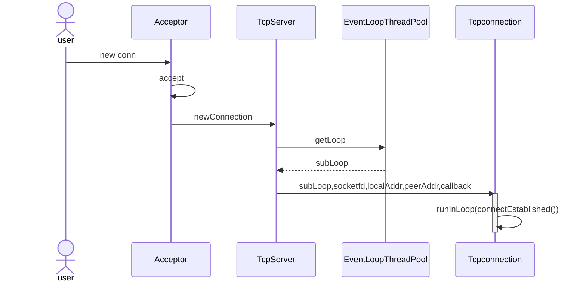

# TinyMuduo
muduo是陈硕开发的c++网络库。
* 使用**Reactor**模式实现。
* 通过**事件驱动**和**函数回调**的方法支持业务的实现。
* 框架基于**one loop per thread + thread pool**的形式。
本人基于c11重构了muduo库中的重要组件，旨在学习其中良好的设计思想。

## 框架


## 压力测试

## 基础类

* **InetAddress**
* **InetAddress**
  * 封装socket地址类型
* **Channel** 
  * 在io多路复用中，一个线程监视多个文件句柄。一旦其中某个句柄就绪，就能够通知对应的应用线程进行相应的读写操作。channel就是对其中文件句柄(文件描述符)的封装。
  * Channel将文件描述符及该描述符对应的回调函数绑定在一起，方便调用。
  * tie_: weak_ptr<void>: 用来跨线程判断该channel是否存在

* **Poller**
  * 抽象了负责监听事件描述符以及返回发生的事件描述符的模块(epoll/poll)。
  * 重构只支持epoll。
* **EPollPoller**
  * 继承自Pollor抽象层，使用epoll实现多路监听复用。

* **Socket**
  * 对sockfd相关方法的封装，bind、accept、listen、shutdown四件套。
* **Buffer**
  * Buffer类封装了用户缓冲区，以及向其中读写数据等方法。


设计方法：
  * 整个网络的通信围绕着客户端到服务器连接的建立，客户端发送信息到服务器，服务器发送信息到客户端以及断开连接这四步进行。
  * 我们以这四步为基础进行运行流程的分析。
  * 客户端到服务器连接建立

* 客户端发送信息到服务器
  * 每个TcpConnection都有一个eventLoop在处理。
  * eventLoop中会关注TcpConnection的可读事件
  * 若eventLoop上发生可读事件，则调用客户注册好的messageCallBack_函数
* 服务器写信息到客户端
  * 服务器调用底层write函数将数据写入Tcp缓冲区中。
  * 调用用户自定义的消息发送后的回调函数(WriteCompleteCallback)
  * 关闭在epoll上注册的写事件。
    * **在epoll_lt模式下，缓冲区不满时会触发可写事件。若没有数据要写入缓冲区但缓冲区不满时会一直触发可写事件，浪费系统资源与时间。所以当消息发送后要关闭写事件。**
* 断开连接
  * 断开连接的方式有两种，主动断开和被动断开
* 主动断开(执行～TcpServer())
  ```c++
  TcpServer::~TcpServer()
  {
      for(auto &item : connections_)
      {
          TcpConnectionPtr conn(item.second);
          item.second.reset();    // 把原始的智能指针复位 让栈空间的TcpConnectionPtr conn指向该对象 当conn出了其作用域 即可释放智能指针指向的对象
          // 销毁连接
          conn->getLoop()->runInLoop(
              std::bind(&TcpConnection::connectDestroyed, conn));
      }
  }
  ```
  * 网络库主动调用析构函数时，需要释放器所有的所有connections对象。
  * connections_为map，key为名字，value为TcpConnection。
  * 通过reset操作使得该指针生存期只在这个for循环中
  * TcpConnection::connectDestroyed函数关闭channel上的监听描述符，并将channel从poller中移除
* 被动断开
  * Tcp通信中，若从套接字中读取到eof，则说明客户端要断开连接。
  * TcpConnection::handleClose(设置套接字状态kDisconnected+channel置为disable)->
    TcpServer::removeConnection()(到mainLoop中)->
    TcpServer::removeConnectionInLoop()(删除该connection)->
    TcpConnection::connectDestroyed()(subEventLoop 关闭资源)
  
* 若关闭时，TcpConnection中有正在发送的数据，怎么保证该数据能发送完呢？
  * 采用了shared_from_this + 弱智能指针lock的方法，尝试提升为shared_ptr.
  * 若提升成功，则说明对象还存在。在接下来调用处理函数的过程中，能够保证对象一直存在(shared_ptr)，不被析构.
